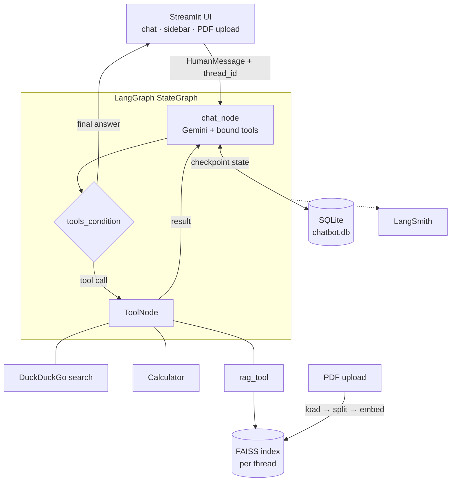

# LangGraph Chatbot

A conversational agent built on LangGraph with tool calling, PDF-based RAG, token streaming, and persistent multi-thread chat history — served through a Streamlit UI.

## Key Features

- **Stateful agent graph** — LangGraph `StateGraph` with a conditional LLM → tools → LLM loop (`tools_condition`), so the model can chain multiple tool calls in one turn.
- **Tool calling** — DuckDuckGo web search, an arithmetic calculator, and a document retrieval tool, all bound to the LLM.
- **PDF RAG** — upload a PDF per chat; it is chunked (`RecursiveCharacterTextSplitter`), embedded with Google embeddings, and indexed in FAISS. Retrieval is exposed to the agent as a tool rather than force-injected into the prompt.
- **Per-thread document isolation** — each chat thread owns its own retriever, so uploads never leak across conversations.
- **Token streaming** — responses stream to the UI via `stream_mode="messages"`, filtered so internal tool results stay hidden.
- **Persistence** — `SqliteSaver` checkpointer stores full conversation state in SQLite; past threads are listed in the sidebar and resume exactly where they left off.
- **MCP integration** — a separate client connects to a local MCP server over stdio and loads its tools into the same graph (`langchain-mcp-adapters`).
- **Observability** — LangSmith tracing with per-turn run names and thread metadata.

## Architecture



## Tech Stack

| Layer | Choice |
|---|---|
| Orchestration | LangGraph 1.2 (`StateGraph`, `ToolNode`, `SqliteSaver`) |
| LLM / Embeddings | Google Gemini via `langchain-google-genai` |
| Vector store | FAISS (`faiss-cpu`) |
| Document loading | `pypdf` / `PyPDFLoader` |
| Tools | DuckDuckGo Search, custom LangChain tools, MCP (`langchain-mcp-adapters`) |
| Persistence | SQLite |
| Frontend | Streamlit |
| Tracing | LangSmith |
| Language | Python 3.12 |

## Project Structure

The repo is organized as incremental stages, each backend paired with a frontend. The RAG pair is the complete application.

```
├── chatbot_backend_rag.py            # Main graph: tools + RAG + SQLite checkpointer
├── streamlit_frontend_with_rag.py    # Main UI: streaming, PDF upload, thread history
│
├── chatbot_backend_withTools.py      # Stage: tool calling + persistence
├── streamlit_frontend_database.py    #        paired UI
├── database_backend.py               # Stage: SQLite persistence only
├── langgraph_backend.py              # Stage: minimal graph, in-memory state
├── streamlit_frontend_streaming.py   # Stage: streaming UI
├── streamlit_frontend.py             # Stage: basic invoke UI
├── streamlit_resume.message.py       # Stage: thread titles + resume
│
├── chatbot_with_mcp.py               # MCP client wiring an external tool server
└── Tools/
    ├── calculator.py                 # @tool arithmetic
    └── serachEngine.py               # DuckDuckGo search tool
```

## Setup

```bash
python3 -m venv myenv && source myenv/bin/activate

pip install langgraph langgraph-checkpoint-sqlite langchain langchain-community \
            langchain-google-genai langchain-text-splitters langchain-mcp-adapters \
            faiss-cpu pypdf ddgs streamlit python-dotenv langsmith
```

Create a `.env` file:

```env
GOOGLE_API_KEY=your_key

# optional — tracing
LANGSMITH_API_KEY=your_key
LANGSMITH_TRACING=true
LANGSMITH_PROJECT=langgraph-chatbot
```

## Run

```bash
# full app — RAG + tools + streaming + persistence
streamlit run streamlit_frontend_with_rag.py

# MCP client (set your server path in chatbot_with_mcp.py first)
python3 chatbot_with_mcp.py
```

Upload a PDF from the sidebar to enable document questions; use **New Chat** to start a fresh thread.

## Future Improvements

- Move per-thread FAISS indexes to a persistent vector store so uploads survive restarts
- Support multiple documents per thread with source citations in the UI
- Async graph execution and streaming for the MCP path
- Package dependencies in `requirements.txt` / `pyproject.toml`
